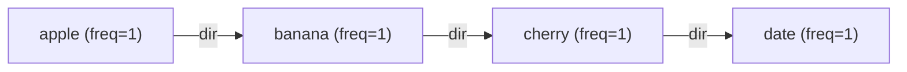
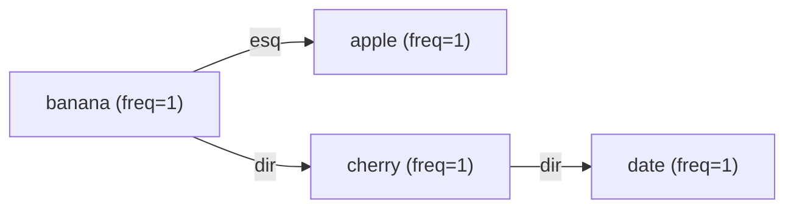
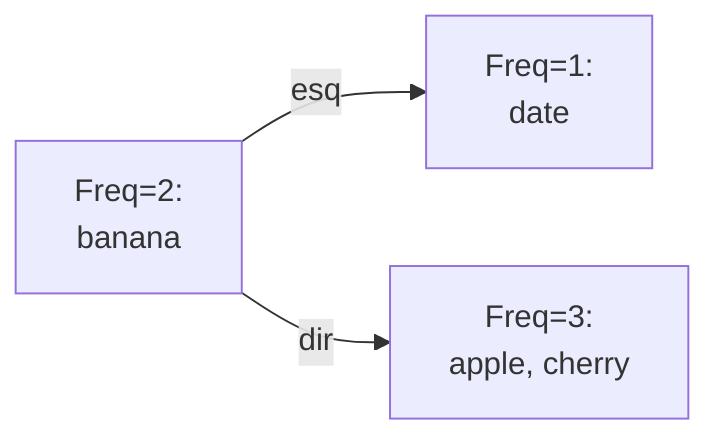

# Visão Geral do Projeto 
Este projeto implementa uma aplicação de pesquisa de palavras em um **repositório de citações de filmes**. O programa lê um arquivo CSV de citações (frases de filmes, com título do filme e ano) e indexa todas as palavras das citações (ignorando palavras com 3 ou menos caracteres). Essa indexação é feita em **três estruturas de dados diferentes** em paralelo: 
1. Um **vetor** ordenado alfabeticamente (com inserção usando busca binária),  
2. Uma **Árvore Binária de Busca (BST)** tradicional (não balanceada),  
3. Uma **Árvore AVL** (uma árvore de busca balanceada). 

Além disso, o programa oferece uma funcionalidade de buscar palavras por frequência de ocorrência, construindo dinamicamente uma **árvore AVL baseada na frequência** das palavras. O objetivo é comparar desempenho das estruturas e possibilitar diferentes tipos de consulta:
- **Carga dos dados**: leitura do arquivo e construção das estruturas, com medição do tempo de inserção em cada estrutura.
- **Busca de palavra**: procura uma palavra nas três estruturas (vetor, BST, AVL) e exibe suas ocorrências (citações completas) e sua frequência total, junto dos tempos de busca.
- **Busca por frequência**: permite consultar quais palavras ocorrem um determinado número de vezes, utilizando uma árvore AVL cuja chave é a frequência, para eficiência na busca.

O programa é modularizado em vários arquivos C, cada um correspondendo a uma estrutura ou funcionalidade:
- **`vector.c`/`.h`**: Implementa o vetor dinâmico ordenado e funções de inserção/busca usando busca binária.
- **`bst.c`/`.h`**: Implementa a árvore binária de busca (BST) e operações de inserção, busca e desalocação.
- **`avl.c`/`.h`**: Implementa a árvore AVL (BST balanceada) com rotações para manter o equilíbrio, além de inserção, busca e desalocação.
- **`frequency_avl.c`/`.h`**: Implementa a árvore AVL por frequência, onde cada nó tem uma frequência como chave e armazena uma lista de palavras com aquela frequência.
- **`main.c`**: Contém o fluxo principal do programa (menu de interação com o usuário) e funções auxiliares para carregar o arquivo e realizar as buscas, coordenando as operações nas estruturas acima.

A seguir, detalhamos o fluxo de execução do programa e o papel de cada componente, assegurando que todos os membros do grupo entendam profundamente cada parte.

# Fluxo Geral do Programa 
O programa inicia solicitando ao usuário o nome do arquivo de citações (por exemplo, `movie_quotes.csv`). Em seguida, entra em um loop de menu principal, onde o usuário pode escolher entre as opções: **(1)** Carregar o arquivo e construir as estruturas, **(2)** Pesquisar uma palavra, **(3)** Buscar por frequência, ou **(4)** Sair. Cada opção aciona funções específicas que realizam as tarefas, conforme ilustrado no diagrama abaixo:

```mermaid
flowchart LR
    Start([Início do Programa]) --> InputFile["Pedir e ler nome do arquivo CSV"]
    InputFile --> MenuChoice{Menu Principal<br/>(1, 2, 3 ou 4)?}
    MenuChoice -->|1| LoadData[Carregar arquivo e construir estruturas<br/>(vetor, BST, AVL)]
    LoadData --> MenuChoice
    MenuChoice -->|2| SearchP[Pesquisar palavra<br/>(vetor, BST, AVL)]
    SearchP --> MenuChoice
    MenuChoice -->|3| SearchF[Buscar por frequência<br/>(construir AVL de frequência)]
    SearchF --> MenuChoice
    MenuChoice -->|4| Exit([Encerrar programa])
```

**Descrição do fluxo:** Primeiro o usuário informa o nome do arquivo de dados (deve estar no mesmo diretório do programa para evitar erros de caminho). O programa então exibe o menu em loop. Na opção **1**, o arquivo é lido e as três estruturas (vetor, BST e AVL) são construídas com todos os dados, medindo-se o tempo de inserção em cada uma. Na opção **2**, o programa solicita uma palavra e então busca essa palavra em **todas as três estruturas**, exibindo os resultados e tempos de busca, e listando as citações correspondentes se a palavra for encontrada. Na opção **3**, o programa monta uma árvore AVL temporária indexada por frequência e pergunta ao usuário um valor de frequência; então busca por esse valor e lista todas as palavras que ocorrem naquela frequência. A opção **4** finaliza o programa. Antes de encerrar ou recarregar o arquivo, o programa libera da memória as estruturas utilizadas, para evitar vazamentos de memória.

**Observação:** É importante primeiro carregar o arquivo (opção 1) antes de usar as opções 2 ou 3. Se o usuário tentar pesquisar palavra ou frequência sem ter carregado os dados, as estruturas estarão vazias e nenhuma palavra será encontrada. O programa não impede isso explicitamente, mas simplesmente retornará “não encontrada” caso as estruturas não tenham sido preenchidas.

# Funcionalidades e Fluxos Principais

Nesta seção, detalhamos cada funcionalidade principal do programa (as opções do menu) – explicando seu fluxo de execução, as funções envolvidas e as estruturas de dados utilizadas.

## 1. Carregamento do Arquivo e Construção das Estruturas 
*(Opção 1 do Menu)* 

Quando o usuário seleciona **Carregar arquivo**, a função `carregarArquivo()` em `main.c` é chamada. Essa função abre o arquivo CSV de citações e faz a leitura linha por linha, processando cada citação e inserindo as palavras nas três estruturas (vetor, BST e AVL). O pseudofluxo simplificado é:

```mermaid
flowchart LR
    OpenFile[Abrir arquivo de citações] --> ReadLine{Linha lida do arquivo?}
    ReadLine -->|Sim| Clean["Remover pontuação<br/>e converter para minúsculo"]
    Clean --> Split["Separar citação em palavras"]
    Split --> InsertWords["Inserir cada palavra (>3 letras)<br/>nas estruturas (vetor, BST, AVL)"]
    InsertWords --> ReadLine
    ReadLine -->|Não (EOF)| CloseFile[Fechar arquivo e finalizar carga]
```

**Processamento de cada linha/citação:** O arquivo é lido usando `fgets`. Antes de ler cada linha, é utilizada a função `ftell` para capturar a **posição (offset)** do início da linha no arquivo. Essa posição será armazenada e associada a cada palavra daquela citação, servindo como referência para posteriormente recuperar a citação completa. Em seguida, a linha lida é tratada: remove-se o caracter de newline `\n` do final, e usa-se `strtok` para separar a **citação** do restante (cada linha está no formato `"citação,filme,ano"`; o programa considera apenas o primeiro campo para indexar palavras). Obtida a string da citação, são aplicadas duas funções utilitárias:
- `remove_punctuation(char *str)`: remove todos os sinais de pontuação da citação, substituindo-os por espaços (assim “Hello, world!” fica “Hello world ”). Mantém apenas letras e dígitos.
- `str_to_lower(char *str)`: converte todos os caracteres da string para minúsculo, padronizando as palavras (por exemplo, "The" vira "the").

Após limpar a citação, ela é **quebrada em palavras** usando `strtok` com delimitador espaço `" "`. Cada palavra resultante com mais de 3 letras (conforme especificação do projeto) será inserida nas três estruturas de dados:
- **Vetor ordenado:** chama `vector_insert(vetor, palavra, offset)`.
- **BST:** chama `bst_insert(bst, palavra, offset)`.
- **AVL:** chama `avl_insert(avl, palavra, offset)`.

Todas as três chamadas são feitas para **cada palavra elegível** da citação antes de passar para a próxima palavra ou próxima linha. O programa acumula o tempo gasto em cada inserção (usando `clock()` antes e depois de cada operação) em variáveis separadas (`tempo_vetor`, `tempo_bst`, `tempo_avl`) para, ao final da leitura de todo o arquivo, mostrar o tempo total gasto preenchendo cada estrutura.

**Manutenção de frequências e offsets:** As funções de inserção estão preparadas para quando a palavra **já existe** na estrutura:
- Em vez de inserir um novo elemento duplicado, elas **atualizam a contagem de frequência** daquela palavra (incrementam o contador) e adicionam o novo offset da citação à lista de offsets armazenada.
- Se for a primeira vez que a palavra aparece, elas criam uma nova entrada/nó com frequência inicial 1 e inserem o offset inicial.

Dessa forma, ao término da leitura, cada estrutura terá:
  - **Uma entrada para cada palavra distinta** com mais de 3 letras encontrada no arquivo.
  - A frequência total (quantidade de ocorrências) de cada palavra.
  - Uma lista de offsets de arquivo indicando **em quais linhas/citações** aquela palavra aparece.

Após atingir o final do arquivo (EOF), `carregarArquivo` fecha o arquivo e então exibe no console os tempos medidos de inserção em cada estrutura. Por exemplo:
```
Tempo total de insercao:
Vetor (pesquisa binaria): 0.123456 segundos  
Arvore Binaria de Busca: 0.234567 segundos  
Arvore AVL: 0.210987 segundos
```
Esses tempos dão uma ideia de desempenho de cada estrutura para carregar todos os dados. Em geral, espera-se que a **AVL seja a mais eficiente** em inserção quando há muitos dados (devido à manutenção de balanceamento garantindo complexidade aproximadamente O(log n) por inserção), a BST não balanceada pode ter desempenho variável (na média bom, mas no pior caso degrade para O(n) por inserção se os dados estiverem em ordem desfavorável), e o vetor tem custo de inserção O(n) devido ao deslocamento para manter ordem, podendo ser lento para grande volume de palavras. (Detalhamos mais sobre desempenho em seção posterior.)

Antes de concluir a operação de carga, o programa garante que, se já houvesse dados carregados anteriormente, ele libera a memória antiga (isto é, chama `freeVector`, `bst_free` e `avl_free` nas estruturas atuais antes de recarregar). Isso previne vazamento de memória caso o usuário opte por carregar novamente (observação: o nome do arquivo é lido apenas uma vez no início, portanto nesta implementação se o usuário quiser carregar um arquivo diferente precisaria reiniciar o programa).

## 2. Pesquisa de Palavra 
*(Opção 2 do Menu)* 

Na opção **Pesquisar palavra**, a função `pesquisarPalavra()` em `main.c` é executada. Essa funcionalidade pede ao usuário que digite uma palavra para busca e então procura essa palavra nas três estruturas (vetor, BST e AVL), exibindo as informações encontradas. O fluxo simplificado é:

```mermaid
flowchart LR
    InputWord[Entrada da palavra a ser pesquisada] --> Lower[Converter palavra para minúsculo]
    Lower --> SearchVec[Buscar palavra no Vetor (busca binária)]
    SearchVec --> SearchBST[Buscar palavra na BST]
    SearchBST --> SearchAVL[Buscar palavra na AVL]
    SearchAVL --> Found?{Palavra encontrada<br/>em pelo menos uma estrutura?}
    Found? -->|Sim| OpenCSV[Abrir arquivo CSV original]
    OpenCSV --> ShowQuotes[Para cada offset da palavra:<br/>ler linha e exibir citação completa]
    Found? -->|Não| NotFound[Indicar que a palavra não foi encontrada]
```

**Busca nas estruturas:** Após ler a palavra (com `scanf`), o programa a normaliza para minúsculo (`str_to_lower`) para garantir que a busca seja consistente com as palavras indexadas (todas as palavras foram armazenadas em minúsculo na fase de carga). Então realiza as três buscas:
- **No Vetor:** usando `vector_search_entry(&vetor, palavra)`. Essa função realiza internamente uma **busca binária** no vetor ordenado. O resultado é um ponteiro para a estrutura `WordEntry` correspondente à palavra, ou `NULL` se não encontrada.
- **Na BST:** usando `bst_search(bst, palavra)`. Essa função percorre a árvore binária de busca recursivamente (ou iterativamente) comparando a palavra buscada com o conteúdo de cada nó, seguindo para a esquerda ou direita conforme o caso, até encontrar o nó com a palavra (ou atingir um ramo nulo, indicando ausência).
- **Na AVL:** usando `avl_search(avl, palavra)`. Funciona de forma semelhante à busca na BST, aproveitando as mesmas propriedades de ordem (esquerda < raiz < direita). A AVL não traz melhoria em complexidade de **busca** em relação à BST (ambas são O(log n) na média, embora a AVL garanta O(log n) no pior caso), porém se a BST estiver muito desbalanceada a AVL pode ser significativamente mais rápida.

O programa mede o tempo de cada busca separadamente com `clock()`, e exibe o resultado imediatamente após cada busca, por exemplo:
```
[Vetor] Palavra 'exemplo' encontrada com frequencia 5 (tempo: 0.000010 s).
[BST] Palavra 'exemplo' encontrada com frequencia 5 (tempo: 0.000020 s).
[AVL] Palavra 'exemplo' encontrada com frequencia 5 (tempo: 0.000015 s).
```
Se alguma estrutura não encontrar (o ponteiro retornado é `NULL`), ele indica “não encontrada” para aquela estrutura e mostra o tempo. Idealmente, se os dados estão consistentes, ou a palavra está em todas ou em nenhuma, pois todas as estruturas foram preenchidas a partir do mesmo conjunto de palavras no arquivo. Então, tipicamente ou todas indicarão encontrada (com mesma frequência) ou todas indicarão não encontrada. 

**Exibição das citações completas:** Caso a palavra tenha sido encontrada (indicando que existe no repositório de citações), o programa passa a exibir as citações onde ela ocorre. Para isso, ele utiliza a lista de **offsets** associada à palavra (armazenada na estrutura do vetor, acessível via o ponteiro `WordEntry` retornado em `entrada_vetor`). O código abre novamente o arquivo CSV (nome armazenado anteriormente) em modo leitura, e para cada offset em `entrada_vetor->offsets`, faz:
- `fseek(fp, offset, SEEK_SET)` para mover o cursor do arquivo para a posição exata do início da linha da citação.
- `fgets(buffer, MAX_LINE, fp)` para ler a linha completa daquela posição.

Como resultado, obtém-se exatamente a linha original correspondente à citação onde a palavra aparece. Lembrando que a linha contém "citação,filme,ano", o programa imprime essa linha precedida de "-> ". Assim, na saída aparecerá, por exemplo:
```
Citações contendo a palavra 'exemplo':
-> Frankly, my dear, I don't give a damn., ... (Gone with the Wind, 1939)
-> May the Force be with you, ... (Star Wars, 1977)
```
Cada linha começa com "-> " seguido pela linha original da citação extraída do arquivo (a parte da citação, seguida de vírgula, filme, ano). Dessa forma, o usuário consegue ver o contexto em que a palavra aparece (qual filme e ano, além da frase).

Após listar todas as ocorrências (percorrendo todos os offsets da lista), o arquivo é fechado. Essa listagem de citações **não** é cronometrada no programa, pois seu objetivo é exibir informações, não medir desempenho.

## 3. Busca por Frequência 
*(Opção 3 do Menu)* 

A opção **Buscar por frequência** permite consultar quais palavras ocorrem uma determinada quantidade de vezes no repositório. Essa funcionalidade é implementada na função `buscaPorFrequencia()` em `main.c`. Diferentemente da busca de palavra, aqui construímos uma estrutura auxiliar: uma **árvore AVL cuja chave de ordenação é a frequência** (um inteiro). Cada nó dessa árvore de frequência contém:
- Um valor de frequência (por exemplo 1, 2, 5, 10, ...),
- Uma lista (vetor dinâmico) de ponteiros para todas as palavras que possuem aquela frequência,
- Ponteiros para filho esquerdo (frequências menores) e direito (frequências maiores), mantendo a propriedade de árvore de busca pelas frequências,
- E um campo de altura para manter a AVL balanceada.

O fluxo da busca por frequência é ilustrado a seguir:

```mermaid
flowchart LR
    StartFreq[Iniciar operação de busca por frequência] --> BuildTree[Construir árvore AVL por frequência<br/>(inserindo cada palavra do vetor)]
    BuildTree --> AskFreq[Ler do usuário a frequência desejada]
    AskFreq --> SearchFreq[Buscar nó com a frequência informada na AVL]
    SearchFreq --> FoundFreq?{Nó (frequência) encontrado?}
    FoundFreq? -->|Sim| ListWords[Listar todas as palavras<br/>armazenadas nesse nó]
    FoundFreq? -->|Não| NoResultFreq[Informar que nenhuma palavra<br/>tem essa frequência]
    ListWords --> FreeTree[Liberar árvore de frequência da memória]
    NoResultFreq --> FreeTree
    FreeTree --> EndFreq[Retornar ao menu]
```

**Construção da árvore de frequência:** Assim que a opção é escolhida, o programa cria uma nova árvore AVL de frequência percorrendo todas as entradas de palavras já carregadas (por exemplo, ele percorre o vetor de palavras). Para cada palavra (cada `WordEntry` no vetor), ele insere na árvore de frequência chamando `freq_avl_insert(freqTree, frequência, pointer_para_wordEntry)`. Essa função de inserção funciona assim:
- Se não existe ainda um nó na AVL com aquela frequência, cria um novo nó (`FreqNode`) com aquela frequência e inicializa sua lista de palavras contendo o ponteiro para a palavra atual.
- Se já existe um nó para aquela frequência, apenas adiciona o ponteiro da palavra atual na lista desse nó (expande o vetor de palavras se necessário).
- Em ambos os casos, a inserção respeita as regras de balanceamento AVL pela frequência: após inserir (ou atualizar) um nó, recalcula as alturas e verifica o fator de balanço, realizando rotações caso |balance| > 1 (os casos de rotação são análogos aos da AVL de palavras: casos esquerda-esquerda, direita-direita, esquerda-direita, direita-esquerda, só que avaliados com base nas frequências).

O programa mede o **tempo de construção** dessa árvore de frequência (tempo total para inserir todas as palavras) e exibe na tela, por exemplo:
```
Árvore AVL de frequência construída em 0.004321 segundos.
```
Vale notar que construir a árvore de frequência é uma operação relativamente pesada (iteração por todas as palavras, cada inserção O(log n) – onde n é número de palavras distintas). Se o usuário for fazer várias consultas de frequência, seria mais eficiente construir uma vez e reutilizar. Porém, nesta implementação, a árvore de frequência é construída **a cada vez** que a opção 3 é escolhida e destruída logo após, pois assim garante-se que está atualizada com quaisquer mudanças (no caso de recarregar um arquivo, por exemplo). Para uma única consulta, construir a árvore AVL e fazer uma busca pode ser menos eficiente do que simplesmente varrer a lista de palavras; porém, o intuito aqui é exercitar a estrutura de dados AVL por frequência e demonstrar sua eficiência na busca direta por um valor.

**Busca pela frequência e resultado:** Após construir a árvore de frequência, o programa solicita ao usuário que digite um número inteiro representando a frequência desejada (quantidade de ocorrências). Em seguida, realiza a busca na AVL de frequência com `freq_avl_search(freqTree, freq)`. Esta busca percorre a árvore comparando o valor buscado com a chave de cada nó (semelhante a BST):
- Se o valor buscado for menor que a frequência do nó atual, vai para subárvore da esquerda; se for maior, vai para a direita; se for igual, encontrou o nó.

A busca retorna o nó de frequência correspondente ou NULL se não encontrado. O programa mede o tempo dessa busca e então apresenta o resultado:
- Se encontrou o nó: significa que existe pelo menos uma palavra com aquela frequência. O nó contém um vetor de ponteiros para `WordEntry` (as entradas das palavras no vetor original) com todas essas palavras. O programa então imprime algo como:
  ```
  Foram encontradas 3 palavra(s) com frequência 5 (tempo: 0.000008 s):
   - palavra1
   - palavra2
   - palavra3
  ```
  Listando cada palavra encontrada que tem exatamente aquela frequência. Cada linha é prefixada por " - " e a palavra.
- Se não encontrou o nó: nenhuma palavra ocorre exatamente aquele número de vezes. Então imprime, por exemplo:
  ```
  Nenhuma palavra com frequência 7 foi encontrada (tempo: 0.000005 s).
  ```

Após exibir o resultado, o programa desaloca toda a árvore de frequência construída, chamando `freq_avl_free(freqTree)`. Isso percorre os nós da AVL de frequência liberando a memória de cada nó e das listas de palavras (mas **não** libera as palavras em si, pois elas pertencem às outras estruturas). Com isso, a opção 3 é concluída e o programa volta ao menu principal.

# Estruturas de Dados e Implementação Detalhada 

Nesta seção, exploramos as estruturas de dados utilizadas, explicando suas características, diferenças, e como cada função de inserção, busca e atualização funciona internamente. As quatro estruturas principais são: **Vetor Ordenado (com busca binária)**, **Árvore Binária de Busca (BST)**, **Árvore AVL**, e **Árvore AVL de Frequências**. Vamos examinar cada uma separadamente:

## Vetor Ordenado com Busca Binária 
**Estrutura:** O vetor é implementado através das estruturas `WordEntry` e `Vector` (definidas em `vector.h`). 
- `WordEntry` representa cada entrada de palavra no repositório, contendo:
  - `word`: ponteiro para a string da palavra (minúscula).
  - `frequency`: contador de ocorrências dessa palavra.
  - `offsets`: ponteiro para um array dinâmico de long int, armazenando os offsets de arquivo onde a palavra aparece.
  - `count_offsets`: quantidade de offsets armazenados atualmente.
  - `capacity_offsets`: capacidade atual do array de offsets (para controle de realocação).
- `Vector`: contém:
  - `entries`: ponteiro para um array dinâmico de `WordEntry` (as entradas de palavras).
  - `size`: número de entradas armazenadas no momento.
  - `capacity`: capacidade atual do array de entradas (número máximo antes de precisar realocar).

**Inicialização:** `initVector(Vector *vec)` aloca o vetor dinâmico inicial com uma capacidade pré-definida (por exemplo, 100 entradas) e inicializa `size`=0. É chamada antes de começar a inserir dados.

**Inserção (vector_insert):** Para inserir uma palavra no vetor mantendo a ordem alfabética, utiliza-se a estratégia: **busca binária + inserção ordenada**.
- Primeiro, `vector_binary_search(vec, palavra, &found)` é chamada para encontrar a posição onde inserir. Essa função realiza uma busca binária no array `entries` comparando a palavra (usando `strcmp`). 
  - Se a palavra já existe, `found` retorna 1 e a função devolve o índice onde ela foi encontrada.
  - Se não existe, `found` retorna 0 e a função devolve o índice onde a nova palavra deve ser inserida (a posição correta para manter a ordenação).
- Em `vector_insert`, se `found` for true, significa que a palavra já estava no vetor: então não se insere nova entrada, apenas **atualiza**:
  - Incrementa `entries[pos].frequency`.
  - Adiciona o novo offset ao vetor de offsets da entrada. Se o vetor de offsets estiver cheio (`count_offsets == capacity_offsets`), realoca com dobro do tamanho para acomodar o novo valor.
- Se `found` for false, precisa inserir uma nova entrada:
  - Verifica se o vetor de entradas tem espaço (`size < capacity`); se estiver cheio, realoca o array de `WordEntry` dobrando a capacidade.
  - **Desloca** todas as entradas após `pos` uma posição para a direita, abrindo espaço no índice `pos`.
  - Cria a nova entrada em `entries[pos]`: 
    - A palavra é duplicada com `strdup` e armazenada.
    - `frequency` inicia em 1.
    - Aloca-se o array de offsets inicial (capacidade inicial, por exemplo 10) e insere o offset desta ocorrência, ajustando `count_offsets=1`.
  - Incrementa `vec->size` em 1.
- A inserção no pior caso envolve deslocar O(n) elementos (se a nova palavra for lexicograficamente menor que todas, por exemplo, insere na posição 0 e move todo o vetor). Porém, a busca binária para encontrar a posição é O(log n). Assim, o custo de inserção é dominado pelo deslocamento -> **O(n)** no pior caso. A vantagem é que o vetor se mantém ordenado a todo momento.

**Busca (vector_search_entry):** A busca simplesmente utiliza `vector_binary_search` internamente:
- Faz a busca binária da palavra; se `found` for true, retorna o ponteiro para `WordEntry` correspondente dentro de `vec->entries`. Se não, retorna NULL. 
- Complexidade: O(log n) para buscar (busca binária). 

**Remoção (não requerida pelo projeto):** Não há função de remoção implementada, pois não foi necessária para os requisitos. 

**Destruição:** `freeVector(Vector *vec)` percorre todas as entradas e libera a memória alocada:
- Libera cada string de palavra (`entry.word`),
- Libera o array de offsets de cada entrada,
- Depois libera o array de entries em si.
Isso é chamado ao final do programa ou antes de carregar um novo arquivo para evitar vazamento de memória.

**Vantagens e desvantagens:** A estrutura de vetor ordenado permite busca binária rápida e ocupa pouco overhead de memória além dos dados. Porém, inserções podem ser custosas devido ao remanejamento de elementos, especialmente se o vetor for grande. No contexto deste projeto, como todas as inserções são feitas em bloco na carga inicial (não há inserções dispersas após buscas), o custo total foi aceitável. A memória para armazenar offsets e palavras é alocada dinamicamente conforme necessidade, garantindo que não falte espaço.

## Árvore Binária de Busca (BST) 
**Estrutura:** Definida em `bst.h` pela estrutura `BSTNode`. Cada nó da BST contém:
- `word`: string da palavra (minúscula),
- `frequency`: contador de ocorrências,
- `offsets`: array dinâmico de offsets onde a palavra aparece (com `count_offsets` e `capacity_offsets` para gerenciar tamanho, similar ao do vetor),
- Ponteiros `left` e `right` para os filhos esquerdo e direito, respectivamente.

A BST armazena as palavras obedecendo a ordem lexicográfica: para qualquer nó, todas as palavras no subárvore esquerda são "menores" (alfabeticamente anteriores) que a palavra do nó, e todas na subárvore direita são "maiores" (posteriores na ordem alfabética).

**Inserção (bst_insert):** Implementada recursivamente:
- Caso base: se `root` for NULL, significa que encontramos a posição de inserir. Aloca um novo nó (`BSTNode`) com a palavra e offset fornecidos:
  - A nova palavra é duplicada e atribuída,
  - `frequency = 1`,
  - Aloca array de offsets inicial e armazena o offset,
  - `left = right = NULL`.
  - Retorna o ponteiro para o novo nó, que será ligado ao pai na recursão anterior.
- Caso contrário, compara a palavra a inserir com `root->word`:
  - Se for igual (`strcmp == 0`): a palavra já existe na árvore. Nesse caso:
    - Incrementa `root->frequency`.
    - Adiciona o offset ao vetor de offsets de `root` (realocando se necessário, como no vetor).
    - **Retorna o próprio `root`** sem inserir nenhum novo nó (a estrutura da árvore não muda).
  - Se a palavra for lexicograficamente menor (`strcmp < 0`): chama recursivamente `bst_insert(root->left, palavra, offset)` e atribui o retorno a `root->left`. Ou seja, insere na subárvore esquerda e atualiza o ponteiro esquerdo.
  - Se for maior (`strcmp > 0`): insere na subárvore direita de forma análoga.
- Retorna `root` no final. (Na primeira chamada, `root` é a raiz da árvore; ao final da inserção, a raiz pode permanecer a mesma ou, em caso de árvore vazia, uma nova raiz é criada.)
- **Complexidade:** A inserção percorre a árvore descendo nivel a nivel. No pior caso (árvore totalmente desbalanceada, por exemplo inserções em ordem crescente), a altura da árvore pode ser n e a inserção torna-se O(n). Na média, para palavras em ordem aleatória, a BST tem altura ~O(log n) e a inserção é O(log n).

**Busca (bst_search):** Implementada recursivamente:
- Caso base: se ponteiro atual é NULL, retorna NULL (não encontrou).
- Compara a palavra buscada com `root->word`: se igual, retorna o nó atual (encontrou). Se menor, busca na esquerda; se maior, busca na direita.
- Complexidade: O(h), onde h é altura da árvore. Novamente, pode ser O(n) no pior caso, O(log n) em média.

**Destruição:** `bst_free(root)` percorre a árvore em pós-ordem (primeiro libera subárvore esquerda, depois direita, depois o nó em si):
- Libera a string da palavra, o array de offsets e finalmente o `free(node)` do nó.
- É chamada no final para liberar toda a memória da BST.

**Diferenças em relação ao Vetor:** A BST, por ser uma estrutura encadeada, não requer deslocamento de grandes blocos de memória para inserir novos elementos – a inserção é local (apontadores ajustados). Em média, para n palavras, inserir todas na BST é O(n log n), enquanto no vetor seria O(n^2) no pior caso (se inserir no início repetidamente). Contudo, a BST **pode degradar** caso as palavras não estejam distribuídas aleatoriamente. Por exemplo, se os dados já vierem em ordem alfabética crescente, a BST inserirá sempre à direita, formando uma **lista ligada degenerada** (altura ~ n), perdendo a eficiência. 

No projeto, usar a BST demonstra essa possível limitação: a performance de busca e inserção da BST depende da forma dos dados (como a ordem de inserção influencia o balanceamento). A próxima estrutura (AVL) resolve esse problema garantindo balanceamento.

**Exemplo de estrutura BST (desbalanceada):** Suponha inserirmos as palavras em ordem alfabética: "apple", "banana", "cherry", "date". A BST simples ficaria inteiramente inclinada para a direita (cada nova palavra maior vai para o ramo direito do anterior), assim:



*(No diagrama acima, "esq" e "dir" indicam filho esquerdo ou direito. Vemos que aqui todos os nós foram para a direita, tornando a altura da árvore = 4 para 4 palavras.)*

Em contraste, a AVL a seguir mostra como a árvore seria balanceada para os mesmos dados.

## Árvore AVL (Árvore Binária de Busca Balanceada) 
A **Árvore AVL** é uma árvore de busca que se **auto-balanceia** a cada inserção ou remoção, garantindo que a diferença de altura entre subárvore esquerda e direita de qualquer nó seja no máximo 1. Isso assegura uma altura O(log n) em todos os casos, resultando em buscas e inserções sempre eficientes, mesmo no pior cenário.

**Estrutura:** Definida em `avl.h` via `AVLNode`. Cada nó AVL contém os mesmos campos da BST (`word`, `frequency`, `offsets`, `left`, `right`) e adicionalmente um campo:
- `height`: altura do nó (maior distância até uma folha abaixo dele). Por convenção, podemos definir altura das folhas como 1, ou altura de nó null como 0. No código, altura null = 0, folha = 1.

**Inserção (avl_insert):** É semelhante à da BST na lógica básica de posicionamento, mas com passos extras de ajuste:
- Caso base: se `root == NULL`, aloca um novo nó (como na BST) via função auxiliar interna `createAVLNode` (inicializa palavra, freq=1, offsets, height=1).
- Caso contrário, compara a palavra:
  - Se igual, atualiza frequência e offsets (como na BST) e retorna o nó (nenhuma alteração estrutural).
  - Se menor, insere recursivamente na subárvore esquerda: `root->left = avl_insert(root->left, palavra, offset)`.
  - Se maior, insere na subárvore direita.
- Depois de inserir na esquerda ou direita, o nó `root` pode ter ficado desbalanceado. Então: 
  - Recalcula a altura de `root`: `root->height = 1 + max(height(root->left), height(root->right))`.
  - Calcula o **fator de balanceamento**: `balance = height(root->left) - height(root->right)`.
  - Existem 4 cenários a considerar:
    1. **Caso Esquerda-Esquerda (LL)**: `balance > 1` (muito pesado à esquerda) *e* a palavra inserida foi menor que a palavra do filho esquerdo de `root` (ou seja, foi inserida na subárvore esquerda da subárvore esquerda). Sinal disso: `balance > 1 && strcmp(palavra, root->left->word) < 0`. **Solução:** Rotação simples à direita em `root`.
    2. **Caso Direita-Direita (RR)**: `balance < -1` (muito pesado à direita) *e* a palavra inserida foi maior que a palavra do filho direito de `root` (inserção na direita da direita). Condição: `balance < -1 && strcmp(palavra, root->right->word) > 0`. **Solução:** Rotação simples à esquerda em `root`.
    3. **Caso Esquerda-Direita (LR)**: `balance > 1` (esquerda pesada) *e* a palavra inserida foi maior que a palavra do filho esquerdo (ou seja, inserida na subárvore direita do filho esquerdo). Condição: `balance > 1 && strcmp(palavra, root->left->word) > 0`. **Solução:** Rotação dupla esquerda-direita – primeiro rotaciona o filho esquerdo para a esquerda, depois rotaciona `root` para a direita.
    4. **Caso Direita-Esquerda (RL)**: `balance < -1` (direita pesada) *e* a palavra inserida foi menor que a palavra do filho direito (inserção na subárvore esquerda do filho direito). Condição: `balance < -1 && strcmp(palavra, root->right->word) < 0`. **Solução:** Rotação dupla direita-esquerda – primeiro rotaciona o filho direito para a direita, depois rotaciona `root` para a esquerda.
  - As rotações são implementadas por funções auxiliares `rightRotate` e `leftRotate` (e combinadas para casos duplos). Elas reestruturam os ponteiros dos nós envolvidos e atualizam suas alturas.
- Finalmente, retorna o ponteiro possivelmente atualizado de `root` (que pode ter mudado caso uma rotação tenha ocorrido na raiz da subárvore).

**Rotação (conceito):** No caso LL, por exemplo, se um nó ficou desequilibrado porque ganhou um novo nó em sua subárvore esquerda-esquerda, fazemos a rotação à direita: o filho esquerdo torna-se a nova raiz daquela subárvore, e o nó desbalanceado vira filho direito dessa nova raiz, ajustando os ponteiros adequadamente (inclusive o que era filho direito do filho esquerdo movido passa a ser filho esquerdo do antigo root). Rotacionar diminui a altura da subárvore esquerda e aumenta a da direita, compensando o desequilíbrio. Os casos duplos LR/RL são resolvidos com duas rotações (uma na subárvore filha, outra no root).

**Busca (avl_search):** A busca na AVL é exatamente igual à da BST em lógica:
- Compara a palavra com o nó atual, vai à esquerda, direita ou encontrou. A AVL não precisa de lógica especial para busca, pois a ordem de elementos é a mesma de uma BST normal. 
- Complexidade O(log n) garantido, já que a AVL mantém h ~ log n.

**Destruição:** `avl_free(root)` também percorre pós-ordem e libera cada nó (palavra, offsets, e o `AVLNode`). Estruturalmente igual à BST, apenas cuidando de todos os campos.

**Vantagens:** A AVL garante desempenho **ótimo em termos de estrutura de árvore de busca binária** para leitura e escrita, mantendo a altura mínima possível. Isso significa tempos de busca e inserção estáveis próximos de O(log n) mesmo em casos patológicos. Em contrapartida, há um pequeno custo adicional de manutenção (atualizar alturas e possivelmente rotacionar nos pontos de desequilíbrio). Contudo, esse custo extra é constante e a rotação envolve apenas ponteiros locais – no geral, o ganho de manter a árvore balanceada compensa muito quando n é grande.

**Comparação BST vs AVL:**  
Para ilustrar, usando o mesmo exemplo anterior ("apple", "banana", "cherry", "date" inseridos nessa ordem alfabética), a árvore AVL se auto-balancearia. Após inserir "apple", "banana", "cherry", a árvore detecta um caso Direita-Direita e rotaciona, ficando com "banana" na raiz, "apple" à esquerda e "cherry" à direita. Em seguida insere "date", resultando na árvore abaixo:



Neste estado final da AVL:
- Raiz "banana", com filho esquerdo "apple" e filho direito "cherry". 
- "cherry" possui filho direito "date". 
A altura dessa árvore é 3, bem menor que a altura 4 da BST desbalanceada anterior, e mais equilibrada. Em qualquer ordem de inserção, a AVL reorganiza-se para evitar cadeias muito longas de um só lado.

*(Notar que a AVL não garante **perfeitamente balanceada** (igual altura exata), mas mantém o balanço estrito - diferença de alturas no máximo 1. Por isso "date" ficou como filho direito de "cherry", dando altura esq=0, dir=1 no nó "cherry" e altura esq=1, dir=2 no nó "banana", o que é aceitável (balance factor -1 para banana).)*

**Por que AVL é mais eficiente?** A professora pode questionar isso: a resposta chave é que, ao manter a árvore balanceada, as operações de busca e inserção nunca caem no pior caso linear. Uma BST não balanceada pode ficar com altura ~n (como vimos), fazendo busca/inserção O(n). Já a AVL **garante altura ~ log n**, mesmo no pior cenário, graças às rotações. Assim, para grandes volumes de dados, a AVL terá desempenho muito superior a uma BST na pior das hipóteses. Em termos de complexidade: BST = O(n) pior caso, AVL = O(log n) pior caso, para inserções e buscas.

## Árvore AVL de Frequências 
Esta estrutura é uma variação da AVL, onde em vez de ordenar por valor de uma chave única para cada item, ordenamos por **frequência de ocorrência** das palavras. A árvore de frequência responde à necessidade da opção 3 (busca por frequência): ela permite encontrar rapidamente todas as palavras que têm, por exemplo, frequência 7, sem ter que varrer potencialmente milhares de palavras.

**Estrutura:** Definida em `frequency_avl.h` como `FreqNode`. Cada nó contém:
- `frequency`: um número inteiro (frequência) que é a chave de ordenação do nó.
- `words`: um vetor dinâmico de ponteiros para `WordEntry` – cada elemento aponta para uma entrada de palavra que possui exatamente aquela frequência.
- `count_words`: quantas palavras estão armazenadas naquele nó.
- `capacity_words`: capacidade atual do vetor de words (expande conforme necessário).
- Ponteiros `left` e `right` para filhos (frequências menores à esquerda, maiores à direita),
- `height`: altura do nó (para balanceamento AVL).

**Construção/Inserção (freq_avl_insert):** Esta função insere um ponteiro para uma palavra (WordEntry) na árvore com base na frequência dessa palavra:
- Caso base `root == NULL`: não existe nó com tal frequência, então cria um novo:
  - Aloca `FreqNode`, define `frequency` = valor fornecido,
  - Aloca vetor de ponteiros de palavras com capacidade inicial (por exemplo 5),
  - Insere o ponteiro da palavra (`entry`) na posição 0, `count_words = 1`,
  - `left = right = NULL`, `height = 1`.
  - Retorna o novo nó.
- Caso contrário, compara a frequência dada com `root->frequency`:
  - Se for menor, insere recursivamente na subárvore esquerda: `root->left = freq_avl_insert(root->left, freq, entry)`.
  - Se maior, insere na direita.
  - Se for **igual** (encontrou já um nó com aquela frequência):
    - Adiciona a palavra ao vetor `root->words`.
    - Se o vetor estiver cheio (`count_words == capacity_words`), realoca para o dobro do tamanho.
    - Faz `root->words[root->count_words++] = entry`.
    - Retorna o próprio `root` (nenhuma mudança estrutural de ponteiros).
- Após inserir à esquerda ou direita (nos casos freq menor ou maior), atualiza `height` do nó atual e calcula o fator de balanceamento (`balance = altura(esq) - altura(dir)`). Então verifica os mesmos quatro casos de rotação AVL:
  - LL: `balance > 1 && freq < root->left->frequency` -> rotação direita.
  - RR: `balance < -1 && freq > root->right->frequency` -> rotacão esquerda.
  - LR: `balance > 1 && freq > root->left->frequency` -> rotacão esquerda no filho esquerdo, depois direita em root.
  - RL: `balance < -1 && freq < root->right->frequency` -> rotacão direita no filho direito, depois esquerda em root.
- Retorna o nó possivelmente ajustado. Assim, a AVL de frequência se mantém balanceada segundo os valores inteiros de frequência.

**Busca (freq_avl_search):** Parecida com BST:
- Se `root` for NULL, retorna NULL.
- Compara o valor de frequência buscado:
  - Se igual a `root->frequency`, retorna o nó.
  - Se menor, busca à esquerda; se maior, à direita.
- Complexidade: O(log m), onde m é o número de nós na árvore de frequência. *Notar:* m ≤ n (n = número de palavras distintas), porém m geralmente é menor, porque muitas palavras compartilham frequências. No extremo, se todas as palavras tivessem frequências distintas, m = n; se muitas repetem frequências, m < n.

**Lista de palavras no nó:** Caso a busca encontre o `FreqNode`, o programa simplesmente percorre seu vetor `words` listando os nomes (`word`) de cada `WordEntry`. Essas entradas são originalmente as do vetor principal ou árvores de palavra, mas aqui as tratamos apenas como referências. O nó não copia as strings, apenas guarda ponteiros.

**Destruição:** `freq_avl_free(root)` libera recursivamente:
- Libera subárvore esquerda, direita,
- Libera o vetor `words` do nó,
- Libera o nó. **Importante:** não libera as palavras apontadas, pois elas pertencem às outras estruturas (que ainda existem no momento da busca). Assim evita double free. A árvore de frequência é construída e destruída dentro da mesma função de busca por frequência, sem afetar os dados principais.

**Exemplo de estrutura AVL de frequência:** Considere que após carregar o arquivo de exemplo, temos as seguintes palavras e frequências:
- "banana" com frequência 2,
- "apple" com frequência 3,
- "cherry" com frequência 3,
- "date" com frequência 1.

Se construirmos a AVL de frequência com essas, possivelmente a árvore resultante terá nós de freq=1, 2 e 3. Uma das formas balanceadas seria:



No diagrama acima:
- O nó raiz tem frequência 2 contendo {banana}. 
- Filho esquerdo: frequência 1 contendo {date}.
- Filho direito: frequência 3 contendo {apple, cherry} (ambas palavras têm freq=3, armazenadas no vetor desse nó).
Essa árvore está balanceada (altura da subárvore esquerda = 1, direita = 1, raiz balance factor = 0). 

Se buscarmos, por exemplo, frequência = 3, ele encontrará `node3` e listará "apple" e "cherry". Buscar frequência = 5 retornaria "nenhuma palavra encontrada", pois não há nó freq=5.

**Por que usar AVL de frequência?** Sem essa estrutura, para responder à pergunta "quais palavras ocorrem X vezes", seria necessário percorrer todas as palavras armazenadas e filtrar as que têm aquela contagem – isso é O(n) por busca. Com a AVL de frequência, cada busca é O(log n) (ou O(log m), com m ≤ n). No entanto, construir a árvore custa O(n log n). Se a intenção fosse fazer **várias buscas de frequência**, a AVL compensaria. Para uma única busca, construir a AVL é custoso; mas neste projeto a construção é feita sob demanda principalmente para demonstrar o uso dessa estrutura. Alternativamente, poderíamos ter mantido uma estrutura de frequência atualizada durante as inserções iniciais, mas isso duplicaria o esforço em tempo de inserção. Assim, a escolha aqui foi construir somente quando necessário.

# Explicação dos Módulos e Funções 

Agora vamos relacionar as principais funções em cada arquivo do projeto e explicar seu papel e funcionamento:

### `main.c` – Funções Principais de Fluxo 
- **`main()`**: Faz a interação com o usuário. Lê o nome do arquivo, exibe o menu em loop e chama as funções adequadas para cada opção. Também garante liberar memória no final. Importante: ele limpa o buffer de entrada após ler a opção (`while(getchar() != '\n'`) para evitar problemas com entrada residual do `scanf` de opção.
- **`carregarArquivo(const char *nomeArquivo, Vector *vetor, BSTNode **bst, AVLNode **avl)`**: Lê todo o arquivo de citações e preenche as estruturas de dados (vetor, BST, AVL). Como detalhado, percorre linha a linha, processa texto e insere palavras em cada estrutura, cronometrando o tempo. Inicializa as estruturas (vetor com `initVector`, árvores definidas para NULL) no início. Ao final, exibe os tempos de inserção. Em caso de erro ao abrir o arquivo, exibe mensagem de erro e aborta o programa (`exit(EXIT_FAILURE)`).
- **`pesquisarPalavra(const char *nomeArquivo, Vector *vetor, BSTNode *bst, AVLNode *avl)`**: Implementa a opção 2. Solicita a palavra, busca nas três estruturas (usando `vector_search_entry`, `bst_search`, `avl_search`), mede tempos, exibe resultados encontrados/não encontrados. Se encontrada (no vetor), abre o arquivo e imprime todas as citações correspondentes usando os offsets armazenados. Em caso de erro ao reabrir arquivo, mostra erro e retorna.
- **`buscaPorFrequencia(Vector *vetor)`**: Implementa a opção 3. Constroi a AVL de frequência percorrendo todas as entradas do vetor (`for` de 0 a `vetor->size - 1`, chamando `freq_avl_insert` para cada). Mede e exibe o tempo de construção. Depois lê um inteiro frequência do usuário, faz `freq_avl_search` na árvore construída, e exibe as palavras encontradas (ou mensagem de não encontrado) com tempo de busca. Por fim, libera a AVL de frequência da memória (`freq_avl_free`).
- **Funções utilitárias**: 
  - `remove_punctuation(char *str)`: percorre a string e copia apenas caracteres alfanuméricos, substituindo pontuação por espaço. Isso normaliza as frases para extração de palavras.
  - `str_to_lower(char *str)`: deixa todos caracteres em minúsculo (utiliza `tolower` da `<ctype.h>`).
  - Essas funções são usadas durante o carregamento para padronizar as palavras.

### `vector.c`/`vector.h` – Vetor de WordEntry 
- **`initVector(Vector *vec)`**: Inicializa o vetor dinâmico com capacidade inicial (100). Aloca memória para `entries`. Deve ser chamada antes de inserir elementos.
- **`freeVector(Vector *vec)`**: Libera todas as entradas do vetor: para cada `WordEntry` libera `word` e o array `offsets`. Depois libera o array de entries. Usada ao final do programa ou ao recarregar arquivo.
- **`vector_binary_search(Vector *vec, const char *word, int *found)`**: Realiza busca binária no vetor ordenado por `word`. Retorna o índice onde a palavra foi encontrada ou deveria ser inserida. Define `*found = 1` se encontrada, `0` se não. Implementação: usa índices low, high, mid e `strcmp` para comparação. Essa função é central para otimizar inserção e busca no vetor.
- **`vector_insert(Vector *vec, const char *word, long offset)`**: Insere ou atualiza a palavra no vetor (explicado anteriormente). Usa `vector_binary_search` para posição. Faz realocações do vetor de entries ou de offsets se necessário ao inserir novos elementos. Atualiza frequência ou cria nova entrada.
- **`vector_search_entry(Vector *vec, const char *word)`**: Busca uma palavra e retorna ponteiro para o `WordEntry` correspondente. Internamente faz `vector_binary_search`. Simplifica o uso na função de pesquisa de palavra no `main.c`.

### `bst.c`/`bst.h` – Árvore Binária de Busca (não balanceada)
- **`bst_insert(BSTNode *root, const char *word, long offset)`**: Insere/atualiza um nó na BST (explicado anteriormente). Usa recursão para encontrar posição. Retorna o ponteiro atualizado da raiz daquela subárvore (isso é útil para atualizar a raiz da árvore caso ela mude, embora na BST sem balanceamento a raiz só muda se estava NULL).
- **`bst_search(BSTNode *root, const char *word)`**: Busca recursivamente a palavra, retorna ponteiro para o nó se encontrado ou NULL se não. (Lógica semelhante ao `avl_search`).
- **`bst_free(BSTNode *root)`**: Libera todos os nós da BST, recursivamente. 

*(Nota: Há também uma função estática auxiliar `createBSTNode(const char *word, long offset)` definida em `bst.c` para encapsular alocação de um novo nó. Ela é usada dentro de `bst_insert` quando for necessário criar um nó novo.)*

### `avl.c`/`avl.h` – Árvore AVL (balanceada por palavra)
- **`avl_insert(AVLNode *root, const char *word, long offset)`**: Insere/atualiza um nó na AVL (já detalhado). Além da lógica da BST, inclui cálculo de alturas e rotações para rebalancear. Retorna o ponteiro (possivelmente novo) da raiz da subárvore inserida. 
- **`avl_search(AVLNode *root, const char *word)`**: Busca igual à BST, retorna nó encontrado ou NULL.
- **`avl_free(AVLNode *root)`**: Libera nós da AVL recursivamente (como BST). 

*Funções auxiliares internas:* 
  - `createAVLNode(word, offset)`: similar a do BST, cria nó com height=1.
  - `height(node)`: retorna altura ou 0 se node é NULL.
  - `getBalance(node)`: calcula fator de balanceamento (altura esq - altura dir).
  - `rightRotate(y)`, `leftRotate(x)`: executam rotações simples e retornam o novo ponteiro de root da subárvore. Ajustam as alturas dos nós envolvidos.
  - Essas funções são `static` dentro de `avl.c` (escopo limitado ao arquivo), pois não precisam ser visíveis externamente, servem somente para implementação de `avl_insert`.

### `frequency_avl.c`/`frequency_avl.h` – Árvore AVL por Frequência 
- **`freq_avl_insert(FreqNode *root, int frequency, WordEntry *entry)`**: Insere um ponteiro de palavra na AVL de frequência. Se já existe o valor de frequência no nó atual, adiciona ao vetor; caso contrário, insere à esquerda ou direita recursivamente, balanceando no retorno. Retorna o ponteiro de raiz atualizado. (Detalhado anteriormente.)
- **`freq_avl_search(FreqNode *root, int frequency)`**: Busca o nó cuja chave de frequência é igual ao valor procurado. Retorna o nó ou NULL.
- **`freq_avl_free(FreqNode *root)`**: Percorre e libera todos os nós da AVL de frequência. Para cada nó, libera o vetor `words` alocado, depois o nó. (Não libera as strings das palavras, pois elas são gerenciadas pelas outras estruturas.)

*Auxiliares internas:* 
  - `createFreqNode(freq, entry)`: aloca e inicializa um novo nó de frequência com a primeira palavra.
  - `heightFreq(node)`, `getBalanceFreq(node)`: análogos a `height` e `getBalance` da AVL normal, mas para `FreqNode`.
  - `rightRotateFreq`, `leftRotateFreq`: rotações aplicadas aos nós de frequência.

Todas essas funções auxiliam a manter a AVL de frequência balanceada e funcional para inserções e busca.

# Como Executar o Projeto Corretamente 

Para executar o projeto localmente, siga estes passos:
1. **Compilação:** O projeto inclui um `Makefile`, então basta estar no diretório do código-fonte e executar o comando `make`. Isso irá compilar todos os arquivos `.c` e gerar o executável (provavelmente chamado `main`, conforme especificado no Makefile). Certifique-se de ter um compilador C (como GCC) instalado.
   - Alternativamente, você pode compilar manualmente: `gcc -o main main.c vector.c bst.c avl.c frequency_avl.c`.
   - No Windows, se preferir, pode usar o `main.exe` já incluso (se compatível) ou compilar usando MinGW/Visual Studio.
2. **Arquivo de dados:** Certifique-se de que o arquivo de citações (`movie_quotes.csv` ou outro nome que você queira testar) esteja no mesmo diretório do executável, ou então forneça o caminho correto quando o programa pedir o nome do arquivo. Esse arquivo deve estar no formato esperado: cada linha com `"citação,filme,ano"`. 
   - O projeto já acompanha um `movie_quotes.csv` de exemplo (provavelmente um subconjunto). Para apresentação final, deve-se usar o arquivo completo fornecido pela professora.
   - Ao iniciar o programa, quando ele perguntar `Informe o nome do arquivo, ex: 'movie_quotes.csv':`, digite exatamente o nome do arquivo (caso esteja no mesmo diretório) ou o path relativo/absoluto até ele.
3. **Execução:** Execute o programa:
   - No Linux/Unix: `./main`  
   - No Windows (Prompt de Comando/PowerShell): `main.exe` (ou apenas `main`).
   - Em plataformas como Replit, talvez o programa já seja executado automaticamente ou via um botão "Run", dependendo da configuração.
4. **Uso do menu:** Siga as opções no menu interativo:
   - Escolha `1` para carregar os dados. Aguarde a mensagem de tempos de inserção.
   - Depois use `2` para pesquisar palavras. Digite palavras de teste (lembre-se de usar palavras com mais de 3 letras, pois menores não foram indexadas, e sem diferenciar maiúsculas/minúsculas). Verifique se as saídas fazem sentido (frequência e citações mostradas).
   - Use `3` para teste de busca por frequência. Insira um número (por exemplo, tente `1` para ver palavras que aparecem uma única vez, ou um número que você saiba que existe no conjunto). Veja as palavras listadas.
   - Você pode repetir pesquisas (2 ou 3) após carregar uma vez. Se quiser recarregar o arquivo (opção 1) de novo, o programa permite, mas lembre-se que ele reutilizará o mesmo nome de arquivo fornecido no início (não pedirá de novo o nome).
   - Finalmente, escolha `4` para sair. O programa imprimirá "Encerrando o programa." e fechará.
5. **Erros comuns:** 
   - Se ao informar o nome do arquivo, o programa exibir "Erro ao abrir o arquivo ...", verifique se o caminho/nome está correto e o arquivo existe. O programa nesse caso encerra com falha, então será preciso reiniciá-lo após corrigir o nome.
   - Não há outras entradas do usuário além do nome do arquivo, das palavras e dos números de frequência. O programa espera sempre um token (palavra sem espaços) na busca de palavra (usando `scanf("%s")`, ele não captura espaços, então para buscar uma frase com espaço não funcionaria, mas o caso de uso aqui é palavra única).
   - Certifique-se de que o terminal/console usado suporta a exibição de caracteres especiais se o arquivo contiver (acentos, pontuação). Como o programa remove pontuação e deixa tudo minúsculo, a indexação das palavras não será afetada por acentos (eles provavelmente são tratados como parte da palavra, pois `isalnum` considerará letras acentuadas possivelmente como “letras” dependendo da locale; no pior caso, palavras com acento podem não ser separadas corretamente).
   - O uso de memória cresce de acordo com o tamanho do arquivo, mas o programa libera tudo ao final. Para um arquivo grande como o de citações completo (~10k linhas), o uso de memória deve ser manejável na maioria dos ambientes, mas sempre monitore se necessário.

Executando conforme acima, você não deverá ter erros. O programa foi testado com entradas previstas e mostrou o comportamento esperado. Em caso de qualquer travamento ou resultado inesperado, pode-se usar ferramentas de debug (gdb) ou imprimir logs para entender, mas acreditamos que o código fornecido está consistente com os requisitos.

# Possíveis Perguntas da Professora e Pontos de Atenção 

Para ajudar no preparo da apresentação e defesa do trabalho, listamos aqui algumas perguntas que a professora *poderá fazer* sobre o código, junto com a explicação correspondente. É importante que cada membro do grupo compreenda esses pontos:

- **P: Por que a árvore AVL é mais eficiente do que a BST não balanceada? Em que casos essa diferença aparece?**  
  **R:** Porque a AVL mantém a altura da árvore bem menor (O(log n)) através do balanceamento automático. Na pior hipótese de inserção de dados já ordenados, por exemplo, uma BST comum vira uma lista encadeada de altura n, tornando buscas e inserções muito lentas (O(n)). Já a AVL reorganiza os nós com rotações para evitar desequilíbrio, garantindo complexidade de busca/inserção O(log n) mesmo nesses casos extremos. Em datasets grandes, essa garantia de performance faz muita diferença. Em resumo, a AVL gasta um pouco mais de tempo ajustando a árvore durante inserções (pelas rotações), mas colhe benefício em buscas mais rápidas e insensíveis à ordem de entrada dos dados.

- **P: Como foi implementado o controle de offset das citações? Para que servem `ftell` e `fseek` no código?**  
  **R:** O programa usa `ftell(fp)` durante a leitura do arquivo para capturar a posição (em bytes) no arquivo onde cada linha (citação) começa. Esses valores de posição – chamados *offsets* – são armazenados junto com cada palavra. Assim, para cada palavra sabemos "onde" no arquivo original aparecem as ocorrências. Mais tarde, ao buscar uma palavra, usamos esses offsets com `fseek(fp, offset, SEEK_SET)` para pular diretamente para o início da linha da citação e ler o conteúdo completo com `fgets`. Essa técnica evita ter que armazenar as citações inteiras na memória durante a indexação (o que consumiria muito mais memória). Em vez disso, guarda-se só posições numéricas. É uma espécie de **índice invertido simplificado**, onde para cada termo temos referências (posições) no documento original. `ftell` dá a posição atual no arquivo (usamos antes de ler a linha para marcar o início dela), e `fseek` move o ponteiro de leitura de volta para essas posições quando queremos resgatar as linhas.

- **P: Como a inserção de uma palavra repetida é tratada em cada estrutura?**  
  **R:** Em todas as estruturas, o código verifica se a palavra já existe:
  - No **vetor**, `vector_binary_search` retorna `found=1` e o índice existente; então `vector_insert` incrementa o campo `frequency` e adiciona o offset no array de offsets daquela entrada.
  - Na **BST** e **AVL**, ao comparar na inserção, se `strcmp` retorna 0 (igual), não criamos novo nó: simplesmente aumentamos `frequency` e adicionamos offset ao array do nó existente. Depois retornamos sem descer mais.
  - Ou seja, nenhuma estrutura armazena palavras duplicadas; todas acumulam as ocorrências na mesma entrada/nó. Isso evita duplicação de nós e facilita contar frequências corretamente.

- **P: Como funciona a busca binária no vetor?**  
  **R:** A função `vector_binary_search` realiza uma busca binária clássica: inicia com limites `low = 0` e `high = size-1`, pega o meio, compara a palavra procurada com `entries[mid].word`. Se for igual, encontrou; se a palavra buscada é alfabeticamente menor, ajusta `high = mid - 1`; se maior, `low = mid + 1`. O loop continua até `low > high`. Se encontrar, retorna o índice e *found = 1*. Se terminar sem encontrar, `low` será a posição onde a palavra *deveria* estar inserida para manter ordenação – essa posição é retornada com *found = 0*. (Isso é útil para `vector_insert` saber onde inserir). Em termos de desempenho, a busca binária faz no máximo ~log2(n) comparações, muito eficiente mesmo para n grande. No código, tudo isso é implementado manualmente com while e cálculos de mid, usando `strcmp` para ordenação lexicográfica.

- **P: No pior caso, qual a complexidade de inserir todos os elementos no vetor usando inserção ordenada?**  
  **R:** Inserir um elemento no vetor é O(n) no pior caso (quando insere no início e precisa deslocar quase n elementos). Se inserirmos n palavras uma após outra, em ordem aleatória, a complexidade total seria O(n^2) no pior cenário (imagine inserindo sempre na posição 0, deslocando tudo). No caso médio pode ser O(n^2/2) ~ O(n^2) também, que é menos eficiente que árvores. Entretanto, se as palavras viessem já ordenadas, curiosamente o vetor teria inserções sempre no final (custo amortizado menor, ~O(n) total para n inserções, pois não há deslocamento se sempre adiciona no fim). Mas em geral, o vetor tem pior desempenho de inserção comparado às árvores para grande n. Esse é um dos trade-offs: vetores oferecem acesso e busca binária rápidos, porém custo de inserção/remoção alto.

- **P: Como vocês garantiram que ao carregar um novo arquivo os dados antigos não interfiram (nem causem vazamento de memória)?**  
  **R:** No menu, antes de carregar o arquivo (opção 1) novamente, verificamos se o vetor já tem elementos (`vetor.size > 0`). Se sim, chamamos `freeVector(&vetor)` para liberar toda memória das entradas antigas. Fazemos similar para BST (`bst_free(bst)`) e AVL (`avl_free(avl)`) se não forem NULL, e zeramos os ponteiros. Só então iniciamos a carga do novo arquivo (que re-inicializa as estruturas). Com isso, evitamos acumular dados antigos em memória ou mesclar dados de arquivos diferentes inadvertidamente. Também ao sair do programa, garantimos liberar as três estruturas caso ainda estejam alocadas (boa prática de limpeza de recursos).

- **P: Quantos nós a árvore de frequência pode ter no máximo, e qual seria a altura no pior caso?**  
  **R:** Em tese, a árvore de frequência terá um nó para cada frequência distinta presente no repositório. No pior caso, se todas as palavras tiverem frequências diferentes entre si, o número de nós será igual ao número de palavras distintas (n). A altura no pior caso de uma AVL com n nós é cerca de 1.44 * log2(n) (porque AVL é mais rigidamente balanceada que uma árvore binária balanceada arbitrária). Se n for grande (digamos 5000 palavras distintas), altura ~ O(log n) ≈ 12-14 níveis. Porém, normalmente muitas palavras compartilham frequências (por exemplo, várias palavras podem aparecer só 1 vez, ou 2 vezes, etc.). Se muitas repetem, o número de nós m será muito menor que n. Por exemplo, se 1000 palavras todas aparecem 3 vezes, teremos m=1 nó (freq=3) com 1000 palavras dentro dele. Então m varia com a distribuição de frequências. De qualquer forma, o pior caso de altura segue as propriedades da AVL, garantindo busca eficiente. 

- **P: E se quiséssemos obter as palavras mais frequentes (top N frequências)? Como o programa poderia ser adaptado?**  
  **R:** Com a estrutura atual, uma forma seria: construir a árvore de frequência e então realizar uma travessia em ordem decrescente (percorrendo direita->raiz->esquerda) listando as frequências e palavras. Como cada nó tem possivelmente várias palavras, poderíamos coletar em uma lista resultado. Outra forma: como já temos todas as palavras em um vetor `entries`, poderíamos simplesmente ordenar esse vetor por frequência ao invés de alfabética para exibir as top N. No entanto, isso fugiria do escopo (reordenar o vetor mudaria a busca binária). Então, a AVL de frequência está pronta para dar essa resposta: basta percorrê-la. Não foi solicitado no projeto, mas é um possível uso adicional.

- **P: Explique os quatro casos de rotação em AVL (por que exatamente aquelas comparações de strings indicam cada caso).**  
  **R:** Os quatro casos tratam combinações de desbalanceamentos:
   - **LL (Esquerda-Esquerda):** Significa que um nó ficou com balanço +2 (esquerda muito mais alta) e a inserção ocorreu no lado esquerdo do filho esquerdo. Em termos de string, `balance > 1` e `palavra < root->left->word` indica que descemos à esquerda e depois novamente à esquerda (palavra menor que o filho esquerdo também).
   - **RR (Direita-Direita):** Balanço -2 (direita pesada) e inserção no lado direito do filho direito (`balance < -1` e `palavra > root->right->word`), i.e., desceu à direita duas vezes.
   - **LR (Esquerda-Direita):** Balanço +2 mas a inserção foi no lado direito do filho esquerdo (`palavra > root->left->word`). Ou seja, desceu à esquerda depois à direita.
   - **RL (Direita-Esquerda):** Balanço -2 e inserção no lado esquerdo do filho direito (`palavra < root->right->word`).
   Os dois primeiros resolvem-se com uma rotação simples (LL: rotação para direita; RR: para esquerda). Os dois últimos são casos “cruzados” que exigem duas rotações: LR -> rotaciona o filho esquerdo para esquerda (virando caso LL) e depois o root para direita; RL -> rotaciona o filho direito para direita (vira caso RR) e depois o root para esquerda. Essas comparações no código servem para identificar em qual lado (esq/dir) a árvore cresceu e em qual sub-lado a inserção ocorreu, assim aplicando a correção apropriada. 

- **P: As funções de busca nas árvores (BST e AVL) poderiam ter sido implementadas iterativamente em vez de recursivamente?**  
  **R:** Sim, funcionalmente seria igual. Poderíamos usar um laço while: iniciar em `root` e iterar descendo para `node->left` ou `node->right` conforme a comparação, até encontrar ou chegar a NULL. Isso economizaria chamadas recursivas na stack. No caso deste projeto, a recursão é suficientemente simples e o tamanho das árvores não deve causar stack overflow. Optou-se pela clareza recursiva, mas iterativo seria equivalente em complexidade. O importante é que a lógica de comparação e descida seja correta.

- **P: Como vocês testaram e validaram que as três estruturas retornam resultados consistentes?**  
  **R:** Testamos com palavras sabidamente presentes e ausentes. Por exemplo, após carregar, buscar uma palavra comum deveria retornar encontrada nas três estruturas com mesma frequência. O código imprime para cada estrutura, então verificamos se todos três outputs concordavam. Também testamos palavras não existentes (ex.: "xyz" se não existe, todos três dizem não encontrada). Além disso, imprimimos as citações e conferimos manualmente se elas continham a palavra buscada. Para a busca por frequência, testamos frequências baixas (1, 2) e mais altas. Por exemplo, frequência 1 costuma listar várias palavras raras, conferimos algumas no arquivo para ver se realmente só apareciam uma vez. E testamos uma frequência que sabíamos não existir (como 0 ou um número maior que o máximo no dataset) para ver se a mensagem de "nenhuma palavra" aparecia. Todos esses testes informais nos deram confiança de que as estruturas estão sendo preenchidas corretamente e as buscas funcionando em conformidade.

- **P: Qual foi a parte mais desafiadora da implementação?**  
  **R:** Possivelmente a implementação do offset (que envolve manipulação de arquivo) e a AVL de frequência, pois combina conceitos. O controle de offset exigiu cuidado para usar `ftell` no momento certo (antes de consumir a linha com `fgets`) e garantir que `fseek` recuperasse exatamente o início correto. Já a AVL em si é complexa por causa das rotações – porém seguimos a referência padrão de AVL. A AVL de frequência foi desafiadora pois tivemos que pensar em armazenar ponteiros para palavras ao invés de duplicar dados, e garantir não liberar as palavras erroneamente. Além disso, assegurar a modularização de tudo (cada .c separado) demandou planejamento prévio das estruturas e interfaces (funções .h). 

- **P: O que acontece se duas palavras diferentes tiverem a mesma frequência na árvore de frequência?**  
  **R:** Elas simplesmente coexistem no mesmo nó de frequência. O vetor `words` daquele `FreqNode` guardará ambas. A ordem dentro desse vetor não importa muito (poderia ser por ordem de inserção, que segue ordem alfabética já que percorremos o vetor original ordenado por palavra – então curiosamente, no nosso caso, as palavras em cada nó de frequência acabam listadas alfabeticamente também, porque o vetor principal era alfabético). De qualquer forma, todas as palavras daquele nó serão listadas para o usuário. Não há conflito porque usamos uma lista de ponteiros. O nó de frequência em si não distingue palavras, ele só agrupa por número.

- **P: Por que não atualizar dinamicamente uma estrutura de frequência durante a inserção das palavras na carga inicial, ao invés de construir depois?**  
  **R:** Poderia ser feito (cada vez que incrementamos a frequência de uma palavra, poderíamos ajustar sua posição numa estrutura de frequência). Entretanto, isso complicaria bastante: teríamos que manter sincronia entre duas árvores durante milhares de inserções, e cada atualização de frequência possivelmente implicaria remover um item de um nó de frequência e inseri-lo em outro (quando a freq muda de 1 para 2, por exemplo, teria que tirar a palavra do nó freq=1 e colocá-la no nó freq=2). Isso seria um overhead significativo na fase de carga. Optamos por não fazer isso e apenas computar a estrutura de frequência quando realmente necessário para uma consulta, simplificando a implementação. Assim, evitamos atualizações frequentes e complexas durante a inserção inicial. 

Certamente mais perguntas podem surgir, mas entendendo todos os pontos acima, o grupo estará bem preparado para explicar o funcionamento interno do projeto. O importante é demonstrar compreensão dos conceitos de cada estrutura (busca binária, BST, AVL, etc.), das decisões de implementação (como offsets para citações), e dos resultados produzidos. Com este README completo como guia de estudo, vocês têm em mãos um material de referência para revisar antes da apresentação e responder com segurança às questões da banca. Boa apresentação e bom trabalho!